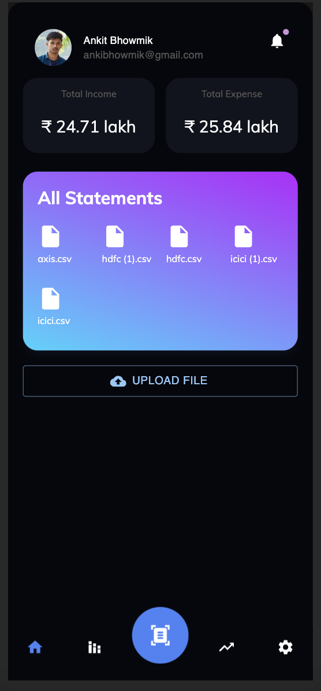
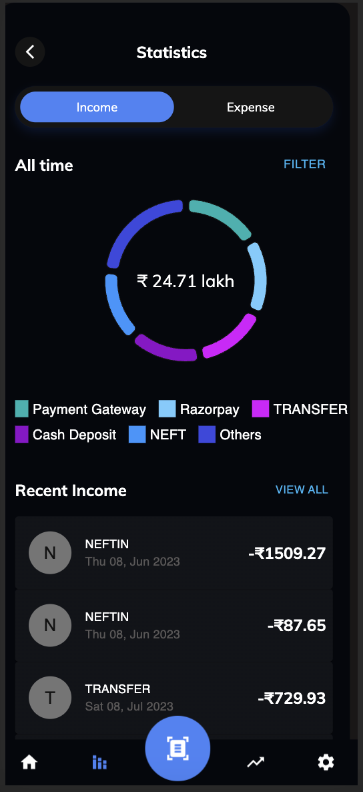
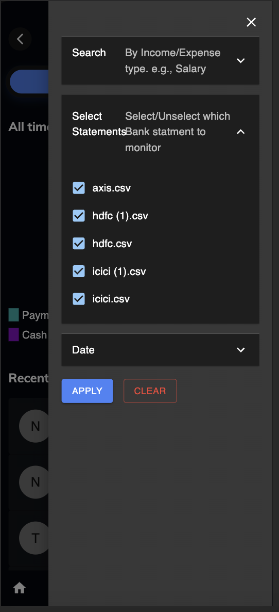
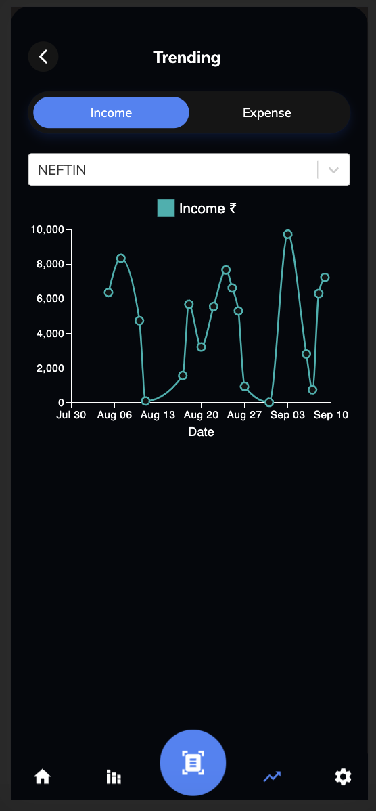

# Valyx Assignment made by Ankit Bhowmik

This project was bootstrapped with [Create React App](https://github.com/facebook/create-react-app).

## how to start in your local machine
1. clone the repo
2. npm install
3. npm start
4. done! no more steps :P

Runs the app in the development mode.\
Open [http://localhost:3000](http://localhost:3000) to view it in your browser.

## Made only the mobile View bcos didn't get much time to make it responsive. but I can also make it responsive

Both task 1 and 2 is done 

initially you have to upload a bank statement.
to do that click on the upload file button
afte uploading a csv. you view will look something like below image

Now click on statics tab (in bottom nav 2nd icon)

In statistics page a view with a pie chart will be shown according to the statement. 

Now you can do filteration (like search by description, statements or date. see below picture for reference)

Now you can also check which category is trending with the help of a line chart

# Thankyou. 

